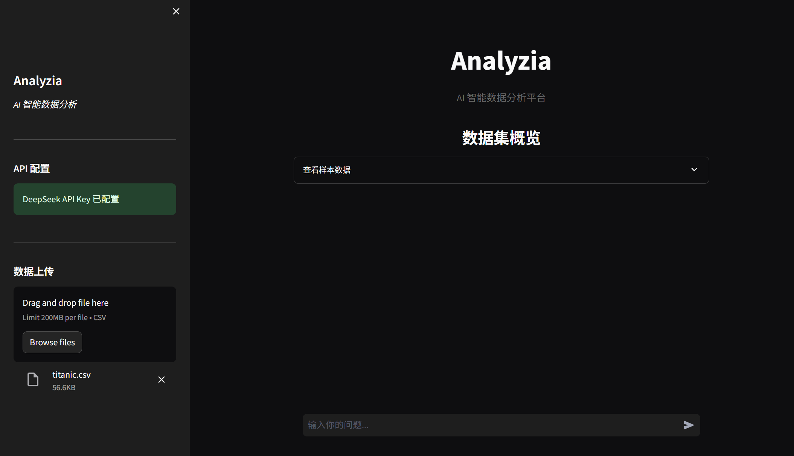
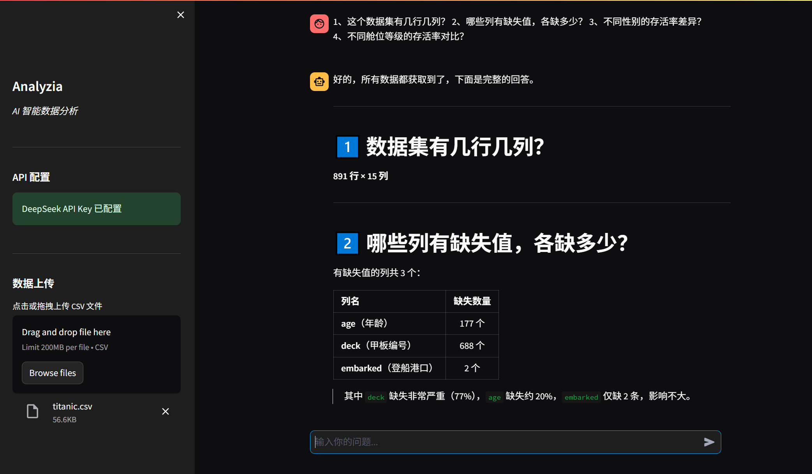
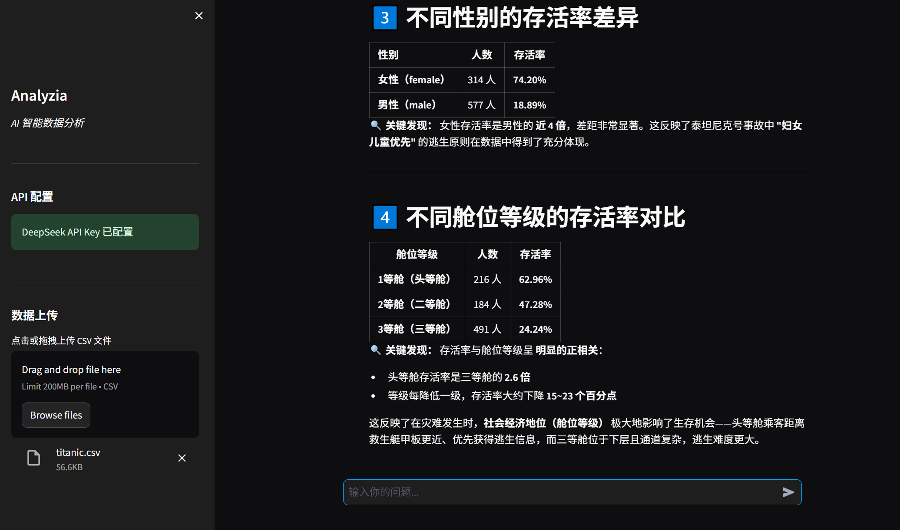
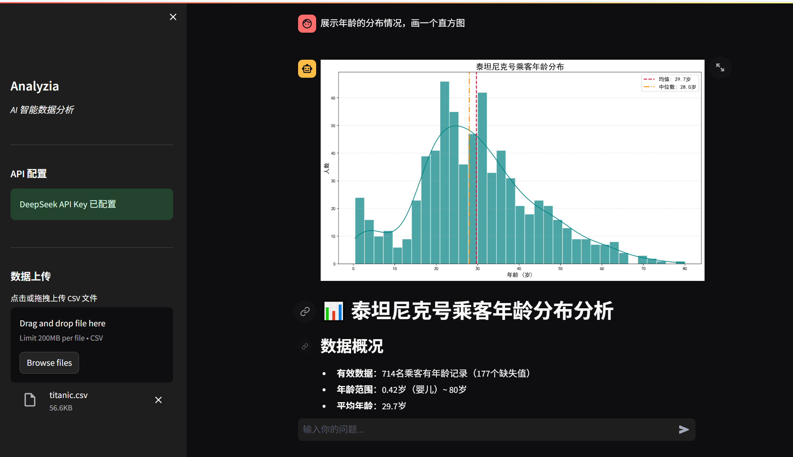
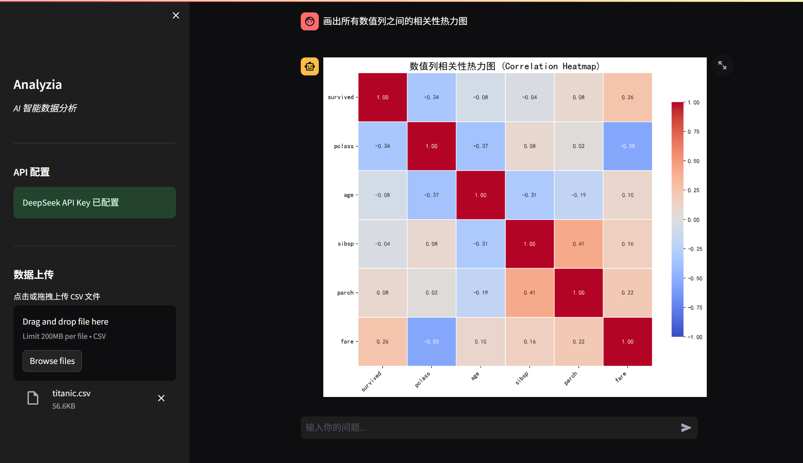
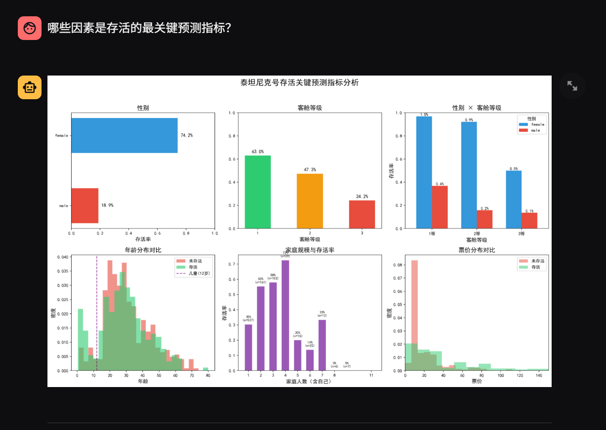
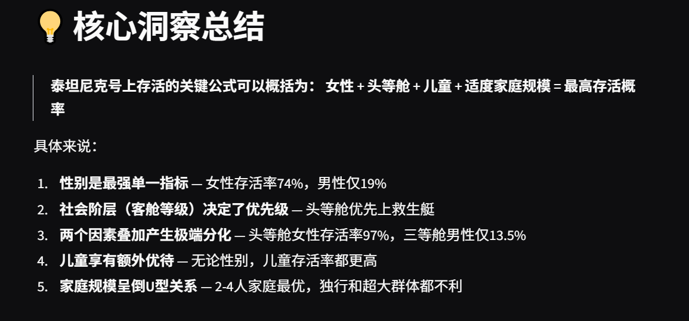

<div align="center">

# Analyzia

**AI 智能数据分析平台：基于 LLM Agent 的对话式分析与可视化系统——支持用户通过自然语言提问数据，自动完成数据理解、统计分析、图表生成与洞察总结。**

[](https://opensource.org/licenses/MIT)
[](https://www.python.org/downloads/)
[](https://streamlit.io)
[](https://langchain.com)
[](https://platform.deepseek.com)

</div>

---

## 目录

- [项目截图](#项目截图)
- [核心功能](#核心功能)
- [快速开始](#快速开始)
- [项目结构](#项目结构)
- [技术栈](#技术栈)
- [核心设计亮点](#核心设计亮点)
- [使用示例](#使用示例)
- [安装与配置](#安装与配置)
- [运行测试](#运行测试)

---

## 项目截图

<div align="center">



*Analyzia 主界面：上传 Titanic 数据集后，用中文自然语言提问，AI 自动生成分析结果*

</div>

---

## 核心功能

<table>
<tr>
<td width="50%">

### AI 驱动的自然语言分析
- 支持中文或英文自然语言提问，无需手写 Python 或 SQL
- 基于 LLM Agent 自动理解数据结构与分析意图，生成并执行 pandas 分析代码
- 支持 DeepSeek 大模型，兼容 OpenAI API 格式

### 专业级数据可视化
- 支持自动生成 Matplotlib / Seaborn 数据分析图表
- 覆盖直方图、柱状图、散点图、热力图、折线图等常见可视化类型
- 对图表标题、坐标轴、配色和布局进行统一规范，提升展示效果

</td>
<td width="50%">

### 智能数据处理
- 自动验证数据质量（缺失值、数据类型、异常值）
- 根据问题复杂度自适应回复：简单问题简短回答，复杂分析详细报告
- 支持中文提问、中文回复

### 对话式交互体验
- 聊天界面，支持多轮对话
- 会话状态持久化，切换页面不丢失进度
- 三层容错机制，确保始终能得到有效回复

</td>
</tr>
</table>

---

## 快速开始

### 前提条件
- Python 3.11 或更高版本
- DeepSeek API Key（[免费注册获取](https://platform.deepseek.com/api_keys)）

### 1. 获取项目

```bash
git clone <你的仓库地址>
cd Analyzia
```

### 2. 安装依赖

```bash
pip install -r requirements.txt
```

### 3. 配置 API Key

在项目根目录创建 `.env` 文件：

```env
DEEPSEEK_API_KEY=你的_API_Key
```

### 4. 启动

```bash
streamlit run app.py
```

### 5. 开始分析

1. 在侧边栏上传 CSV 文件
2. 输入你的问题
3. 获取 AI 分析结果和可视化图表

---

## 项目结构

```
Analyzia/
├── app.py              # 主入口：Streamlit UI 层，页面渲染与用户交互
├── agents.py           # Agent 层：LLMAgent 基类、ResponseProcessor、DataAnalysisAgent
├── tools.py            # 工具层：CustomPythonAstREPLTool（自定义 LangChain 工具）
├── visualization.py    # 可视化层：VisualizationHandler 图表执行引擎
├── utils.py            # 工具层：CodeUtils（代码提取/清洗）、DataFrameUtils
├── prompts/            # 系统提示词模板（Markdown，与代码分离）
│   ├── base_analyst.md # 角色定义、分析框架、质量标准
│   └── csv_agent.md    # 可视化规则、代码模板、输出格式要求
├── tests/              # 单元测试（28 个用例，无需 API Key）
│   ├── test_utils.py
│   ├── test_visualization.py
│   └── test_agents.py
├── test_agent.py       # 集成测试（9 个用例，需 DeepSeek API Key）
├── pytest.ini          # pytest 配置
├── requirements.txt    # Python 依赖
├── .env                # 环境变量（API Key，不提交到 Git）
└── README.md
```

### 各模块职责

| 文件 | 负责内容 |
|------|----------|
| **app.py** | Streamlit 页面配置、侧边栏（API Key + CSV 上传）、聊天界面、session 状态管理。只负责 UI，不含业务逻辑。 |
| **agents.py** | `LLMAgent` —— LLM 初始化；`ResponseProcessor` —— 从 Agent 回复中提取并执行可视化代码；`DataAnalysisAgent` —— setup CSV Agent、处理对话、三层容错。提示词从 `prompts/` 动态加载。 |
| **tools.py** | `CustomPythonAstREPLTool` —— 继承 LangChain 的 `PythonAstREPLTool`，代码执行后自动捕获 matplotlib 图表并渲染到 Streamlit。 |
| **visualization.py** | `VisualizationHandler` —— 提供代码执行上下文（df, plt, np, pd, sns），执行可视化并渲染到 Streamlit。 |
| **prompts/** | `base_analyst.md` —— Agent 角色定义与分析框架；`csv_agent.md` —— 可视化规则与代码模板。Markdown 格式，修改提示词无需改 Python 代码。 |

### 架构依赖

```
utils  ←  tools  ←  visualization  ←  agents  ←  app
(底层工具)  (自定义Tool)  (可视化引擎)     (AI Agent)   (UI 入口)

prompts/ → agents (提示词外部化，由 agents 动态加载)
tests/   → 覆盖 utils / visualization / agents 的核心逻辑
```

---

## 技术栈

| 层级 | 技术 | 用途 |
|------|------|------|
| **前端** | Streamlit | Web 界面，聊天 UI，数据展示 |
| **AI 框架** | LangChain 1.x | Agent 编排，Tool 管理，CSV Agent |
| **大模型** | DeepSeek（deepseek-chat） | 自然语言理解，Python 代码生成 |
| **数据处理** | Pandas、NumPy | CSV 读取、数据清洗、统计分析 |
| **可视化** | Matplotlib、Seaborn | 图表生成，专业排版 |
| **工程** | python-dotenv、pytest、unittest.mock | 环境管理、单元测试、集成测试 |

---

## 核心设计亮点

### 1. Agent 架构，而非简单 API 调用

传统的"AI 数据分析"项目通常是：用户提问 → 调 LLM API → 返回文本。Analyzia 不同：

```
用户提问 → LangChain Agent → LLM 规划步骤 → 自动生成 Python 代码
    → 执行代码 → 读取结果 → 判断是否需要进一步分析 → 返回最终答案
```

AI 像真正的数据分析师一样**自己规划、执行、检验、迭代**，而不是一次性吐出答案。

### 2. 三层容错机制

LLM 的输出不稳定，Agent 可能解析失败。三层容错保证用户始终能得到回复：

- **第一层**：Agent 正常执行 → 返回完整分析结果
- **第二层**：Agent 解析失败 → 从错误信息中用正则提取有用内容
- **第三层**：无法提取 → 直接调用 LLM（绕过 Agent），用备选 prompt 兜底

### 3. 提示词与代码分离

800 行系统提示词不硬编码在 Python 文件里，而是存放在 `prompts/` 目录的 Markdown 文件中：

- 修改提示词无需改代码，产品经理也可以直接编辑
- Git diff 能清晰区分"逻辑变更"和"提示词调整"
- 为将来的 A/B 测试和多版本提示词管理留了扩展空间

### 4. 自定义 LangChain Tool

`CustomPythonAstREPLTool` 继承 LangChain 内置的 `PythonAstREPLTool`，在代码执行后自动捕获 matplotlib 图表并渲染到 Streamlit，避免重复显示。展示了在成熟框架上做定制扩展的能力。

### 5. 完善的测试覆盖

- **28 个单元测试**（`tests/`）：覆盖代码提取、可视化引擎、错误恢复等核心逻辑，7 秒跑完，无需 API Key
- **9 个集成测试**（`test_agent.py`）：用 Titanic 真实数据集验证 AI 回答准确性，自动断言关键数值

---

## 使用示例

以下示例使用 Titanic 数据集（891 行 x 15 列），均为真实测试结果。

### 数据查询

| 用户提问 | AI 回答（关键数字） |
|----------|---------------------|
| 这个数据集有几行几列？ | 891 行，15 列 |
| 哪些列有缺失值，各缺多少？ | age: 177, deck: 688, embarked: 2 |
| 不同性别的存活率差异？ | 女性 74.2%，男性 18.9% |
| 不同舱位等级的存活率对比？ | 头等舱 62.9%，二等舱 47.3%，三等舱 24.2% |




*数据查询示例：AI 正确回答数据集行列数、缺失值统计等问题*

### 可视化

| 用户提问 | 生成图表 |
|----------|----------|
| 展示年龄的分布情况，画一个直方图 | 直方图 + KDE 曲线 |
| 画出所有数值列之间的相关性热力图 | 相关性矩阵热力图 |




*可视化示例：AI 生成的年龄分布直方图与数值列相关性热力图*

### 深度分析

| 用户提问 | AI 回复要点 |
|----------|-------------|
| 哪些因素是存活的最关键预测指标？ | 性别（女性存活率远高于男性）、舱位等级（头等舱优先逃生）、家庭规模 |





*深度分析示例：AI 分析存活率的关键预测指标并给出业务建议*

---

## 安装与配置

### 标准安装

```bash
# 克隆仓库
git clone <你的仓库地址>
cd Analyzia

# 创建虚拟环境（推荐）
python -m venv venv
source venv/bin/activate  # Windows: venv\Scripts\activate

# 安装依赖
pip install -r requirements.txt
```

### 环境变量

在项目根目录创建 `.env` 文件：

```env
# 必填
DEEPSEEK_API_KEY=你的_DeepSeek_API_Key
```

### DeepSeek API Key 获取

1. 访问 [DeepSeek 开放平台](https://platform.deepseek.com/api_keys)
2. 注册并创建 API Key
3. 复制 Key 到 `.env` 文件
4. 充值少量余额（最低约 $2，国内可用支付宝）

---

## 运行测试

### 单元测试（无需 API Key，7 秒完成）

```bash
pytest tests/ -v
```

输出示例：
```
tests/test_utils.py ............ 11 passed
tests/test_visualization.py ....  9 passed
tests/test_agents.py ...........  8 passed
========================================
28 passed
```

### 集成测试（需要 DeepSeek API Key + Titanic 数据集）

集成测试使用 Titanic 数据集验证 AI 回答的准确性，运行前需准备数据：

**1. 下载 Titanic 数据集**

从 Kaggle 下载 `titanic.csv`（约 60KB）：

```bash
# 方式一：直接下载（推荐）
# 访问 https://www.kaggle.com/c/titanic/data 下载 train.csv，重命名为 titanic.csv

# 方式二：使用 kagglehub
pip install kagglehub
python -c "import kagglehub; print(kagglehub.dataset_download('heptapod/titanic'))"
```

**2. 放置数据集**

将 `titanic.csv` 放到项目根目录下（与 `test_agent.py` 同级），或修改 `test_agent.py` 中的 `csv_path` 变量：

```python
csv_path = "./titanic.csv"  # 改为你的实际路径
```

**3. 运行测试**

```bash
pytest test_agent.py -v
```

> 注意：集成测试会消耗 DeepSeek API 额度，建议在需要验证时手动运行。
